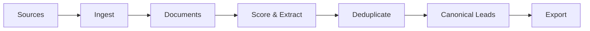

# 🎯 Franchise Lead Radar

**Discover and score potential franchise buyers and struggling gym/studio owners across the web.**

Franchise Lead Radar is an ethical, compliance-first lead generation system that continuously scans public sources to identify:
- **Type A Leads**: Franchise buyer intent (individuals researching/comparing/ready to buy gym/fitness franchises)
- **Type B Leads**: Owner pain signals (existing gym/studio owners struggling with marketing/ops/growth)

## 🚀 Features

### Multi-Source Ingestion
- **Reddit** (official API via PRAW)
- **RSS Feeds** (blogs, news, podcasts)
- **Web Crawling** (robots.txt compliant)
- **YouTube** (official Data API)
- **Manual Imports** (CSV/JSON for Quora, LinkedIn, Facebook exports)

### Intelligent Scoring
- **Explainable AI**: Every lead comes with a detailed "why flagged" breakdown
- **Configurable phrase packs**: High/medium intent signals for buyers and owner pain
- **Proximity matching**: "franchise" near "gym" = higher score
- **Florida-first geography**: Automatic boosting for Florida leads
- **Multi-language support**: English, Spanish, Portuguese phrases

### Deduplication
- Exact URL matching
- Fuzzy handle similarity
- Text similarity grouping
- Canonical lead records with multiple evidence items

### Export & Integration
- **CSV**: General exports
- **HubSpot**: Import-ready format
- **Airtable**: JSON format for easy import
- All exports include scoring breakdown and evidence links

### Compliance Built-In
- ✅ Only public data collection
- ✅ Official APIs only (no scrapers for restricted platforms)
- ✅ robots.txt compliance for web crawling
- ✅ Rate limiting with exponential backoff
- ✅ No login bypassing, no paywalls, no stealth
- ✅ No identity resolution (stores handles + public links only)

## 📋 Prerequisites

- Python 3.12+
- API keys (optional but recommended):
  - Reddit API credentials
  - YouTube API key

## 🔧 Installation

### 1. Clone and Setup

```bash
cd /home/user/franchise
python -m venv venv
source venv/bin/activate  # On Windows: venv\Scripts\activate
pip install -e .
```

### 2. Configure Environment

```bash
cp .env.example .env
# Edit .env with your API keys
```

**Required for full functionality:**
```env
REDDIT_CLIENT_ID=your_client_id
REDDIT_CLIENT_SECRET=your_secret
REDDIT_USER_AGENT=FranchiseRadar/0.1.0

YOUTUBE_API_KEY=your_youtube_key
```

### 3. Initialize Database

```bash
python -m franchise_radar init
```

## 🎮 Quick Start

### Try Demo Mode (No API Keys Required)

```bash
# Create demo leads
python -m franchise_radar demo create --count 10

# View leads
python -m franchise_radar list-leads

# Export to CSV
python -m franchise_radar export csv --output demo_leads.csv

# Start web UI
make run-ui
# Open http://localhost:8000
```

### Real Usage

#### 1. Ingest Data

```bash
# Reddit (last 24 hours)
python -m franchise_radar ingest --source reddit --since 24h

# RSS feeds (from config)
python -m franchise_radar ingest --source rss

# YouTube (last 7 days)
python -m franchise_radar ingest --source youtube --since 7d

# Web crawl (provide seed URLs)
echo "https://example.com/franchises" > seeds.txt
python -m franchise_radar ingest --source web_crawl --seeds seeds.txt
```

#### 2. Score & Create Leads

```bash
# Score all unprocessed documents
python -m franchise_radar score --type all --min-score 40

# Score only franchise buyers
python -m franchise_radar score --type buyer --min-score 60
```

#### 3. View & Export

```bash
# List top leads
python -m franchise_radar list-leads --florida-only --min-score 60

# Export CSV
python -m franchise_radar export csv --output leads.csv

# Export for HubSpot
python -m franchise_radar export hubspot --output hubspot_import.csv --min-score 60

# Export for Airtable
python -m franchise_radar export airtable --output airtable_import.json
```

#### 4. Manual Import

```bash
# Generate template
python -m franchise_radar config-template --output my_import.csv --format csv

# Edit my_import.csv, then import
python -m franchise_radar import my_import.csv --source-name quora_exports
```

## 🌐 Web UI

Start the web interface:

```bash
make run-ui
# or
uvicorn franchise_radar.api.app:app --reload --host 0.0.0.0 --port 8000
```

Visit: http://localhost:8000

Features:
- Real-time stats dashboard
- Lead filtering (type, score, tier, location, status)
- Evidence viewer with "why flagged" breakdown
- CSV export
- Manual file upload (coming soon)

## 📁 Project Structure

```
franchise/
├── src/franchise_radar/
│   ├── api/              # FastAPI application
│   ├── cli/              # Typer CLI commands
│   ├── config/           # YAML configuration loader
│   ├── dedupe/           # Deduplication engine
│   ├── extraction/       # Entity extraction
│   ├── ingest/           # Source adapters
│   │   ├── reddit_adapter.py
│   │   ├── rss_adapter.py
│   │   ├── web_crawler.py
│   │   ├── youtube_adapter.py
│   │   └── manual_import.py
│   ├── models/           # SQLModel database models
│   └── scoring/          # Scoring engine
├── config/               # YAML configuration files
│   ├── general_gym_franchise.yaml
│   └── boutique_fitness.yaml
├── templates/            # Jinja2 templates
├── static/              # CSS, JS
├── tests/               # Pytest tests
├── data/                # SQLite database (auto-created)
├── pyproject.toml
├── Makefile
└── README.md
```

## ⚙️ Configuration

### Default Config: `config/general_gym_franchise.yaml`

Includes:
- Florida cities and counties list
- Phrase packs (high/medium intent for buyers and owner pain)
- Scoring weights and thresholds
- Source configurations (subreddits, YouTube queries, RSS feeds)
- Rate limits
- Multi-language phrases

### Custom Configs

Create your own YAML config:

```yaml
version: "1.0"
name: "my_custom_config"

geography:
  florida_only_mode: true
  florida_score_boost: 5

sources:
  reddit:
    subreddits:
      - MyCustomSubreddit

phrase_packs:
  my_custom_phrases:
    - phrase: "custom keyword"
      weight: 10

scoring:
  weights:
    phrase_hits: 1.0
  thresholds:
    buyer_ready: 80
```

Load custom config:
```python
from franchise_radar.config import get_config
config = get_config(config_path="path/to/my_config.yaml")
```

## 🧪 Testing

```bash
# Run all tests
make test

# Run with coverage
pytest tests/ -v --cov=src/franchise_radar --cov-report=html
```

## 🚨 Compliance & Ethics

### ALLOWED ✅
- Official APIs (Reddit, YouTube, etc.)
- Public RSS feeds
- Sitemaps and robots.txt-approved crawling
- User-provided URLs with permission
- Manual CSV/JSON imports of exported data

### NOT ALLOWED ❌
- Scraping behind login walls
- Bypassing paywalls
- Ignoring robots.txt
- Stealth/headless browsers for scraping
- Email/phone harvesting
- Identity resolution services

### Data Retention
- Store only: public handles, URLs, snippets, and publicly stated location/budget/timeline
- No PII collection
- No cross-platform identity matching

### Rate Limiting
All sources implement:
- Configurable requests/minute limits
- Exponential backoff on failures
- Respect for API quotas

## 🐛 Troubleshooting

### "Reddit API not initialized"
- Check `REDDIT_CLIENT_ID` and `REDDIT_CLIENT_SECRET` in `.env`
- Get credentials at: https://www.reddit.com/prefs/apps

### "YouTube API quota exceeded"
- YouTube API has daily limits (10,000 units/day by default)
- Reduce query frequency or request quota increase

### "robots.txt disallows crawling"
- Web crawler respects robots.txt automatically
- For disallowed sites, use manual import instead

### Rate limit errors
- Adjust `rate_limits` in config YAML
- Implement longer delays between requests

## 📊 Database Schema

**SQLite** (migration-ready to PostgreSQL):

- `sources` - Source configurations
- `documents` - Raw ingested documents
- `leads` - Canonical lead records
- `evidence` - Evidence linking documents to leads
- `runs` - Ingestion run tracking
- `configs` - Configuration versions
- `notes` - Lead notes and status history

## 🔄 Workflow



## 🗺️ Roadmap

- [ ] Podcast transcript ingestion
- [ ] Slack/Discord export import templates
- [ ] Email alert system for high-score leads
- [ ] PostgreSQL migration guide
- [ ] Kubernetes deployment config
- [ ] Advanced ML scoring models
- [ ] Lead enrichment hooks

## 📝 License

MIT License - See LICENSE file

## 🤝 Contributing

Contributions welcome! Please ensure:
1. All new sources are compliant (official APIs or user-provided data only)
2. Tests included for new features
3. Update documentation

## 📧 Support

- Issues: https://github.com/your-repo/franchise-radar/issues
- Discussions: https://github.com/your-repo/franchise-radar/discussions

---

**Built with Python, FastAPI, SQLModel, HTMX, and a commitment to ethical data collection.**
